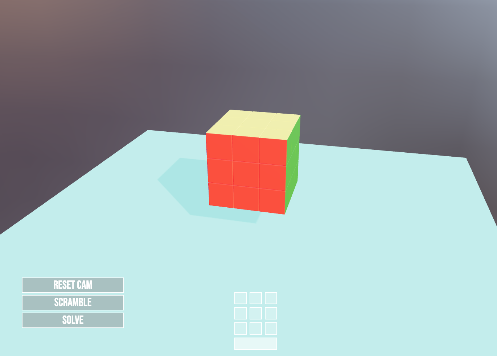

# [Rubiks-cube](https://.kyledlong.com)

This project aims to virtualise the movments of a rubiks cube. Created with React and Threejs
<br>




## Tech

|                   |               |
| ----------------- | ------------- |
| React Three Fiber | Drei          |
| JS                | Three.js      |
| HTML              | CSS           |
| Vite              | Github actions|
| Hostinger         | Webhooks      |


<br>

This project is a basic static website created using HTML, CSS, and JavaScript. For package management and development server, we use npm as the Node Package Manager along with Vite. Our Continuous Integration (CI) process involves automatically building artifacts from the main branch into the build branch whenever changes are pushed. This is achieved through GitHub Actions. Additionally, we have configured a webhook to send a POST request to a specified URL (in our case, Hostinger). As a result, any updates pushed to the main branch will trigger a build and update the production site accordingly.

<br>

## How to Use
<br>

1. Clone the repository:

```bash
git clone https://github.com/KD-Long/rubiks-cube.git
```

2. Install the dependencies:

```bash
cd rubiks-cube
npm install
```

3. Run the project:

```bash
npm run dev
```

3. Open your web browser and navigate to http://localhost:3000 to access the project.


## Hard problems


1. Adding and removing cubes to turn groups while retaining transformations
    - Update the groups matrix
    - Iterate over cubes and apply the groups transformation to each cube
    ```js
        turn.turnGroup.updateMatrixWorld(true)
        turn.targetArray.forEach((cube) => {
            cubesRef.current.add(cube);
            cube.applyMatrix4(turn.turnGroup.matrixWorld);
        })
    ```

3. Interface/keyboard control intergration
    - Instead of passing props up and down children (is hard because of linked functions/effects)
    - Simulates keyboard events on interface allowing for Keyboard controler to handlew logic with set key combinations
    ```js
        const keyDownEvent = new KeyboardEvent('keydown', { key });
        window.dispatchEvent(keyDownEvent);
    ```

3. Concurrnet async keyboard events trigering syncronus turn events
    - A queue of turns where the first turn is consumed piece by piece in useFrame (lerp with an exit condition)
    - On the first entry point to a new turn within the queue update its "target pivot turn group" (the 9 cubes that need to be turned)
        - This prevents each turn on the queue holding onto to cubes (bit like a lock)